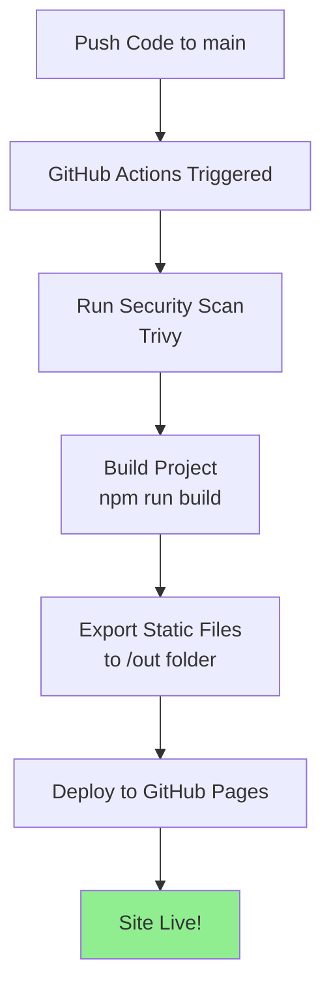

# Files Added for GitHub Pages Deployment

## New Files Created

### 1. **next.config.js** (Root Directory)
```javascript
// Enables static HTML export for GitHub Pages
output: 'export'
images: { unoptimized: true }
// Optional: basePath for subdirectory deployment
```
**Purpose:** Configures Next.js for static site generation

---

### 2. **.github/workflows/deploy.yml** (New Workflow)
```yaml
# Automatic deployment pipeline that:
# - Triggers on push to main branch
# - Installs dependencies
# - Runs Trivy security scan
# - Builds the project
# - Deploys to GitHub Pages
```
**Purpose:** CI/CD automation for seamless deployment

---

### 3. **DEPLOYMENT.md** (Documentation)
Comprehensive guide covering:
- Configuration overview
- Step-by-step deployment instructions
- Troubleshooting common issues
- Performance optimization tips
- Post-deployment verification

---

### 4. **GITHUB_PAGES_SETUP.md** (Quick Reference)
Quick-start guide with:
- 5-minute setup steps
- What happens automatically
- Deployment testing checklist
- Common troubleshooting

---

## Files Modified

### **package.json**
Added new scripts:
```json
"export": "next build && next export",
"deploy": "npm run export && echo 'nojekyll' > out/.nojekyll"
```

---

## How It Works



---

## Deployment Flow

### Automatic (Recommended)
```
Code Push → GitHub Actions → Security Check → Build → Deploy → Live
                ↓                                                  ↓
         .github/workflows/deploy.yml                    GitHub Pages Server
```

### Manual (If Needed)
```
npm run build → out/ folder contains static files → Upload to GitHub Pages
```

---

## Environment Variables

If you need environment variables in the future:

1. **Development:** Create `.env.local` (already in .gitignore)
2. **GitHub Actions:** Add to repository Secrets
   - Go to Settings → Secrets and variables → Actions
   - Click "New repository secret"
   - Reference in workflow: `${{ secrets.YOUR_SECRET_NAME }}`

---

## Build Output

After `npm run build`:
```
out/
├── index.html           # Main page
├── 404.html             # Error page
├── images/              # Static images
├── _next/
│   ├── static/         # CSS/JS chunks
│   └── data/           # Build metadata
└── .nojekyll           # GitHub Pages config (added by deploy script)
```

---

## Configuration Checklist

- ✅ `next.config.js` - Static export enabled
- ✅ `.github/workflows/deploy.yml` - Automation script
- ✅ `package.json` - Build/export scripts updated
- ✅ `.gitignore` - Already excludes `/out/` and `/.next/`
- ✅ Project builds successfully
- ✅ Trivy scan passes (0 vulnerabilities)

---

## Undoing/Removing GitHub Pages Setup

If you need to remove GitHub Pages setup:

```bash
# Delete workflow
rm -rf .github/workflows/deploy.yml

# Delete config docs
rm DEPLOYMENT.md GITHUB_PAGES_SETUP.md

# Restore to server deployment (add to next.config.js)
# Remove: output: 'export'
# Restore: Use vercel.json or other server config
```

---

## Common File Locations

| File | Purpose | Location |
|------|---------|----------|
| config | Next.js settings | `next.config.js` |
| workflow | GitHub Actions | `.github/workflows/deploy.yml` |
| exported site | Static files | `out/` (generated) |
| documentation | Setup guides | `DEPLOYMENT.md`, `GITHUB_PAGES_SETUP.md` |
| scripts | Build commands | `package.json` |

---

## Next Steps

1. ✅ Review the configuration (already done!)
2. 📝 Read `GITHUB_PAGES_SETUP.md` for quick start
3. 🚀 Push to GitHub: `git push origin main`
4. ⚙️ Enable GitHub Pages in repo settings
5. 🎉 Watch your site deploy automatically!

---

**All configurations are production-ready. No additional setup needed!** ✨
